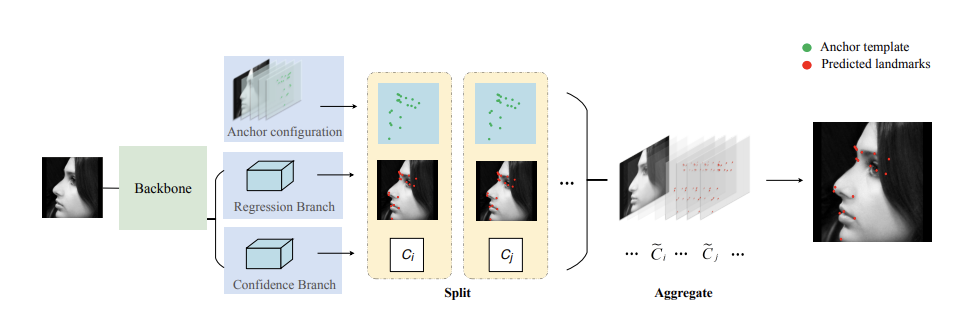
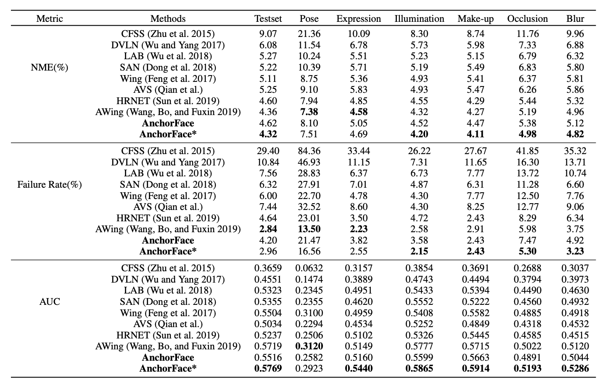

# AnchorFace

Official implementation of our paper *AnchorFace: An Anchor-based Facial Landmark Detector Across Large Poses*, which is accepted by **AAAI 2021**.

Code will be released soon~

# Abstract
Facial landmark localization aims to detect the predefined points of human faces, and the topic has been rapidly improved with
the recent development of neural network based methods. However, it remains a challenging task when dealing with faces in unconstrained scenarios, especially with large pose variations. In this paper, we target the problem of facial landmark localization across large poses and address
this task based on a split-and-aggregate strategy. To split the search space, we propose a set of anchor templates as references for regression, which well addresses the large variations of face poses. Based on the prediction of each anchor template, we propose to aggregate the results, which can reduce the landmark uncertainty due to the large poses. Overall, our proposed approach, named AnchorFace, obtains state-ofthe-art results with extremely efficient inference speed on four challenging benchmarks, i.e. AFLW, 300W, Menpo, and WFLW dataset.
# Method

# Results(WFLW)

# Usage
# Citation
```
@article{AnchorFace,
  title={AnchorFace: An Anchor-based Facial Landmark Detector Across Large Poses},
  author={Xu, Zixuan and Li, Banghuai and Geng, Miao and Yuan, Ye and Yu, Gang},
  journal={arXiv preprint arXiv:2007.03221},
  year={2020}
}
```
